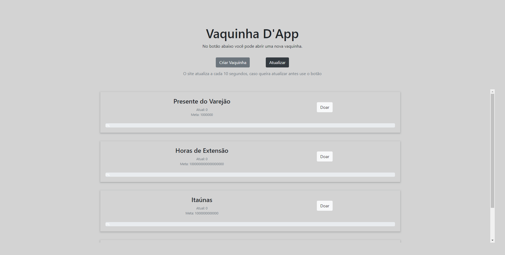

<a name="readme-top"></a>

# Vaquinha-DApp

An Ethereum Decentralized Application for a Donation contract factory.


- The user can create and donate to existing Vaquinhas.

- The money (Goerli) that is donated to a Vaquinha is stored inside the Smart Contract until the owner collects it.

- When a Vaquinha has reached its goal, an event will be emitted by the Smart Contract where a message will appear to notify the user a Vaquinha can be collected.



<hr>

## About the project

### Built with

<div style="display: flex; align-items:center; justify-content: center">
    <div style="display: inline-block;"><br>
        
        
        
            
    </div>
</div>

<p align="right">(<a href="#readme-top">back to top</a>)</p>

### Implementation
<br>
The [Smart Contract](contract/Contract.sol) implements three functions:

```bash
    function getBalance()

    function transfer()
    
    function withdraw(address sender)
```

The [Contract Factory](contract/Contract.sol) implements seven functions:
```bash
    function createDonation(string memory name, uint goal, address owner)

    function getDonationsNames()

    function getDonationsAddresses()

    function donateByName(string memory name)

    function withdrawByName(string memory name)

    function getBalanceByDonationName(string memory name)

    function getGoalByDonationName(string memory name)
```
<p align="right">(<a href="#readme-top">back to top</a>)</p>